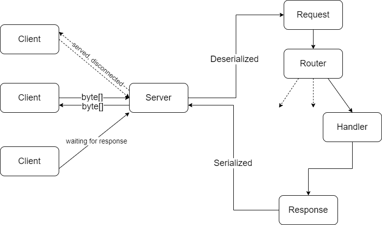

# HTTP 1.1 Server implementation

This is a simple implementation of HTTP 1.1 protocol using ServerSocketChannel.

## Request and Response

Request and Response are implemented in 2 classes with the same names, respectively. Each has the first line, the headers and the
body.

There are several grammars for headers in the original docs, here only implemented the Entity-Header with structure _(
field:value CRLF)\*_

The body is only a sequence of bytes. For structural data like JSON, the JSON package in this repos can be used.

## Server
The Server serves clients in turn: iterates over each listened client (key). Each data stream coming in a channel is wrapped into a Request object, which then be fed to the handling function. Response message is serialized from the result - a Response object. After sending the message, the key will be removed.

Handling functions are registered before starting the server. A handling function is a functional object which receives a Request object and returns a Response object.
## Limitation
The server only works well when the connection is stable, which guarantees for the message to be transferred successfully in one time, due to the lack of retransmission support of the Server.

## Using
This server is adapted with the java.net HttpClient, HttpResponse and HttpRequest. The Server is initialized with a
host, a port and a Router object. Handling functions are registered with the Router.

Examples are written in the test package. The Request and Response are guaranteed to be true because the serialized data
from HttpRequest and HttpResponse can be deserialized into them.

## References

[Hypertext Transfer Protocol -- HTTP/1.1](https://www.w3.org/Protocols/HTTP/1.1/draft-ietf-http-v11-spec-01.html)
